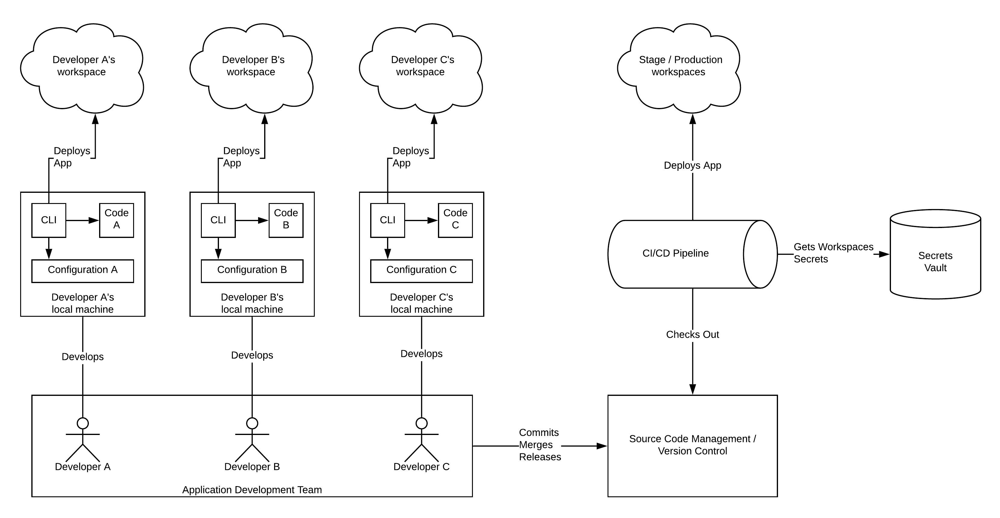
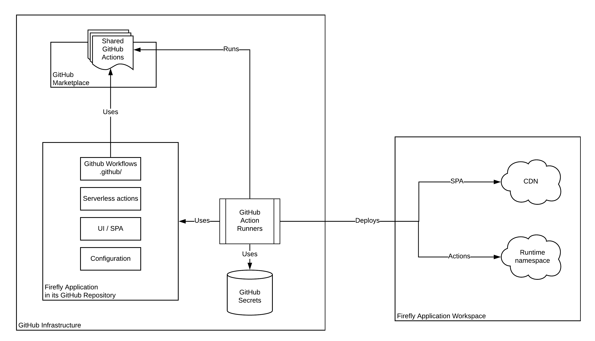

# CI/CD for Firefly Applications
Continuous integraion and continuous delivery (CI/CD) is a crucial component for the success of any development team -- a team working on Firefly Applications is no difference. 

Allowing the development team to focus on requirements, code quality, and security with deployment automated, CI/CD is one of the best practice to implement and for us to support. 

Project Firefly allows you to manage multiple environments. This is achieved through **Workspace** in Adobe Developer Console. Every new application project created by an entitled organization administrator or developer in the Developer Console will be setup with two named workspaces: Stage and Production. Each workspace will have its own setup:

- List of Adobe services to integrate via user or technical user accounts
- Runtime namespace
- Related credentials and secrets (API Key, access token, Runtime namespace credentials...)

The entitled organization users will also be allowed to create as many additional workspaces as required by their project, whether this is to add an extra stage (e.g. qa, preproduction...) to match their infrastructure needs, or to define developer specific workspaces for each of their development team member to work locally against.

## GitHub Actions Support
A sample CI/CD workflow is provided out-of-the-box on top of [GitHub Actions](https://github.com/features/actions).
Upon bootstrapping of a new Firefly application from the [CLI](https://github.com/adobe/aio-cli) by using the `aio app init` command, the application generator asks the developer whether to `include GitHub Actions based workflows for Build, Test and Deploy`.

If the developer selects this option, the application code will be initialized with an additional `.github` folder at its root. This folder contains default [GitHub Workflows](https://github.com/adobe/generator-aio-app/tree/master/generators/add-ci/.github/workflows) that can be extended at application level depending on the developer's needs.

### Github Workflows

The default GitHub Workflows enable the following actions based on specific Github events triggered on the application repository:

- On `Pull Request`, the application unit tests are executed by calling `aio app test` against the requested changes. See the [PR workflow](https://github.com/adobe/generator-aio-app/blob/master/generators/add-ci/.github/workflows/pr_test.yml).

- On `Branch Merge`, the application gets deployed to the `Stage` workspace by calling `aio app deploy`. The back-end serverless actions get deployed to Runtime, while the SPA gets deployed to the out-of-the-box CDN if the application has a web UI. See the [Deploy Stage workflow](https://github.com/adobe/generator-aio-app/blob/master/generators/add-ci/.github/workflows/deploy_stage.yml).

- On `Repository Release`, the application gets deployed to the `Production` workspace by calling `aio app deploy`. The back-end serverless actions get deployed to Runtime, while the SPA gets deployed to the out-of-the-box CDN if the application has a web UI. See the [Deploy Prod workflow](https://github.com/adobe/generator-aio-app/blob/master/generators/add-ci/.github/workflows/deploy_prod.yml).

Each of the default [Github Workflows](https://help.github.com/en/actions/configuring-and-managing-workflows/configuring-a-workflow) leverages two core features provided by Github: [Github Actions](https://github.com/features/actions) and [Github Secrets](https://help.github.com/en/actions/configuring-and-managing-workflows/creating-and-storing-encrypted-secrets).

### GitHub Actions for AIO CLI

The following [GitHub Actions](https://github.com/features/actions) have been built to support the usage of the [CLI](https://github.com/adobe/aio-cli) in a CI/CD workflow running within GitHub infrastructure.

They are used in the default [Firefly Apps workflows](https://github.com/adobe/generator-aio-app/tree/master/generators/add-ci/.github/workflows), but can also be used further in custom GitHub workflows built by developers to fulfil their project needs.

- The [CLI Setup Action](https://github.com/adobe/aio-cli-setup-action) can be used to install and configure the [CLI](https://github.com/adobe/aio-cli) on the GitHub infrastructure running the workflow that invoked the action.

- The [Apps Action](https://github.com/adobe/aio-apps-action) centralizes the support for a GitHub workflow to leverage several application specific commands, such as testing via `aio app test` and deployment via `aio app deploy`.

These both actions have been published and can be found on GitHub Marketplace. See [CLI Setup](https://github.com/marketplace/actions/aio-cli-setup) and [Apps](https://github.com/marketplace/actions/aio-apps).

### GitHub Secrets

The following [GitHub Actions](https://github.com/features/actions) leverage [GitHub Secrets](https://help.github.com/en/actions/configuring-and-managing-workflows/creating-and-storing-encrypted-secrets) to store environment specific secrets.

They currently need an administrator to manually add the following secrets to the application repository:

- **AIO_RUNTIME_NAMESPACE_STAGE**: the name of the Runtime namespace associated to the `Stage` Firefly project workspace.
- **AIO_RUNTIME_AUTH_STAGE**: the credentials for the Runtime namespace associated to the `Stage` Firefly project workspace.
- **AIO_RUNTIME_NAMESPACE_PROD**: the name of the Runtime namespace associated to the `Prod` Firefly project workspace.
- **AIO_RUNTIME_AUTH_PROD**: the credentials for the Runtime namespace associated to the `Prod` Firefly project workspace.

We aim to simplify this configuration process in the future. 

## Bring your own CI/CD pipeline

The default implementation of the CI/CD workflow for Firefly applications relies on GitHub capabilities. However, a developer might need an alternative solution due to project specific requirements, or team preference.

In that case, we recommend implementing the custom solution with focus on two main aspects:

- The [CLI](https://github.com/adobe/aio-cli) is the official tool to manage the Firefly application development lifecycle from bootstrapping to deployment, and can be used within a CI/CD workflow for automation purpose.
- Security is a key requirement, and any alternative CI/CD workflow should propose a solid secret management solution to store the credentials required to deploy a Firefly application against a specific **Workspace**.
